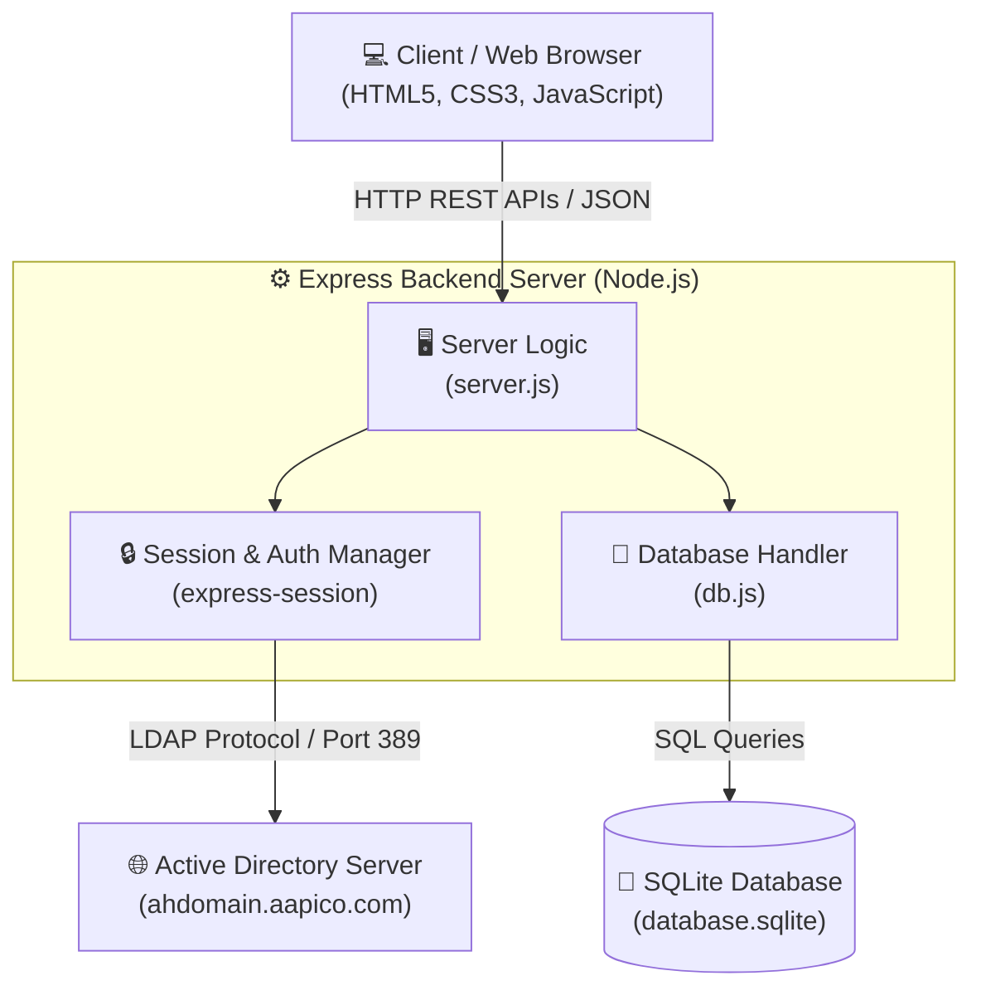
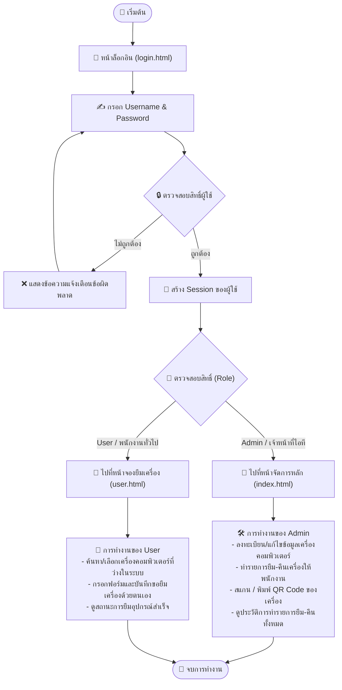
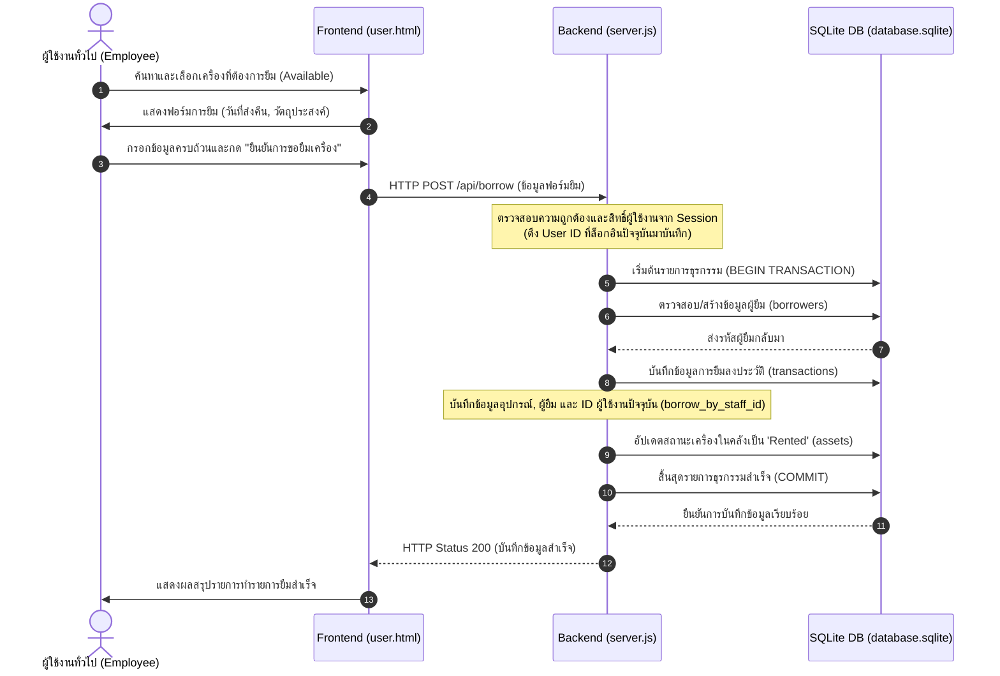
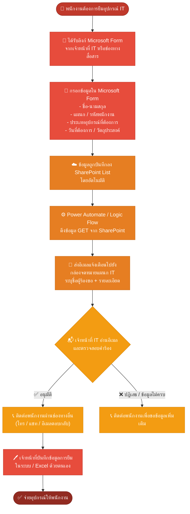
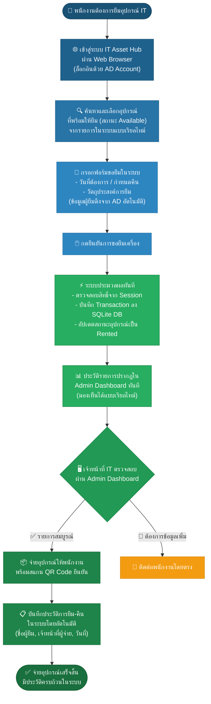

# สรุปภาพรวมการทำงานของระบบ IT Asset Rental System

ระบบ **IT Asset & Rental Management System (IT Asset Hub)** เป็นระบบเว็บแอปพลิเคชันแบบ Full-Stack ที่พัฒนาขึ้นเพื่ออำนวยความสะดวกในการบริหารจัดการอุปกรณ์ไอทีและจัดทำรายการยืม-คืนเครื่องคอมพิวเตอร์ภายในองค์กร โดยบูรณาการความปลอดภัยร่วมกับระบบสิทธิ์พนักงานผ่าน **Active Directory (AD)**

---

## 1. ฟังก์ชันการทำงานหลักของระบบ (Core Features)

### 🔑 ระบบเข้าสู่ระบบ (Authentication & Authorization)
- **การยืนยันตัวตนระดับองค์กร (SSO):** ผู้ใช้ล็อกอินผ่านโปรโตคอล LDAP เชื่อมเข้ากับ Active Directory (AD) ขององค์กร
- **ระบบสำรอง (Local Admin Fallback):** หากเชื่อมต่อกับ Active Directory ไม่ได้ หรือกรณีใช้งานแบบ Local จะมีบัญชี Local Administrator (`admin`) สำรองให้ใช้งาน
- **การนำทางตามสิทธิ์ (Role-Based Redirection):**
  - **Admin (เจ้าหน้าที่ไอที):** จะถูกส่งไปยังหน้า `index.html` เพื่อจัดการระบบทั้งหมด
  - **User (พนักงานทั่วไป):** จะถูกส่งไปยังหน้า `user.html` เพื่อทำรายการขอยืมเครื่องที่ว่าง

---

### 💻 หน้าผู้ดูแลระบบ (Admin Dashboard - `index.html`)
- **สรุปข้อมูล (KPI Metrics):** แสดงจำนวนเครื่องคอมพิวเตอร์พร้อมจ่ายถาวร เครื่องว่างสำหรับยืม และเครื่องที่กำลังถูกยืมใช้งานแบบเรียลไทม์
- **จัดการคลังอุปกรณ์ (Asset Inventory Management):** เพิ่ม แก้ไข ลบ และค้นหาข้อมูลรหัสทรัพย์สิน (Asset Tag), Serial Number, รุ่นเครื่อง และสถานะอุปกรณ์
- **สแกนและพิมพ์รหัส QR Code:** ระบบสามารถสร้าง QR Code สำหรับอุปกรณ์แต่ละชิ้นโดยเฉพาะ เพื่อการสแกนด้วยเครื่องสแกนปืนหรือกล้องเว็บแคมเพื่อตรวจสอบสถานะ
- **บันทึกประวัติยืม-คืนทั้งหมด (Transactions Log):** แสดงข้อมูลวันที่ยืม-คืน ชื่อผู้ยืม และที่สำคัญคือบันทึกชื่อผู้เขียนประวัติรายการ (ผู้บันทึกยืม/ผู้รับคืน) แบบอัตโนมัติ

---

### 📱 หน้าผู้ใช้งานทั่วไป (Employee Portal - `user.html`)
- **รายการเครื่องพร้อมยืม:** พนักงานสามารถค้นหาและตรวจสอบเครื่องคอมพิวเตอร์ (สถานะ Available และประเภทการใช้งานแบบ Rental) ที่ว่างอยู่ได้ด้วยตัวเอง
- **กรอกฟอร์มขอยืมสะดวกรวดเร็ว:** หน้าจอแสดงข้อมูลอุปกรณ์ที่ถูกเลือกอย่างชัดเจน พนักงานระบุข้อมูลส่วนตัว วันที่ขอยืม กำหนดส่งคืน และวัตถุประสงค์
- **บันทึกชื่อผู้ทำรายการยืมโดยตรง:** เมื่อทำรายการขอยืมเครื่องสำเร็จ ระบบจะนำ ID ของผู้ใช้ที่ล็อกอิน ณ ขณะนั้นไปบันทึกเป็นผู้บันทึกยืมลงในประวัติของหน้าผู้ดูแลระบบทันที

---

## 2. แผนภาพสถาปัตยกรรมระบบ (Architecture Diagram)

แผนภาพนี้แสดงโครงสร้างและความเชื่อมโยงของระบบคอมโพเนนต์ต่าง ๆ ตั้งแต่หน้าบ้าน (Frontend) ไปจนถึงเซิร์ฟเวอร์หลังบ้าน (Backend Server), ฐานข้อมูล (SQLite), และเซิร์ฟเวอร์ยืนยันตัวตน (Active Directory)

---

## 3. แผนภาพลำดับการทำงานของระบบ (System Flowchart)

แผนภาพแสดงขั้นตอนการทำงานของแอปพลิเคชัน ตั้งแต่การล็อกอินเข้าสู่ระบบ การตรวจสอบสิทธิ์ (Role) และแยกการทำงานตามสิทธิ์ของผู้ใช้งาน

---

## 4. แผนภาพแสดงลำดับเหตุการณ์การยืมอุปกรณ์ (Sequence Diagram)

ลำดับขั้นตอนและกระบวนการส่งข้อมูลเมื่อพนักงานทั่วไปทำรายการ "ขอยืมเครื่องคอมพิวเตอร์ชั่วคราว" ผ่านหน้าเว็บแอปพลิเคชัน

---

## 5. โครงสร้างฐานข้อมูล (Database Schema)

ระบบใช้งานฐานข้อมูลแบบเชิงสัมพันธ์ (Relational Database) ด้วย SQLite3 ประกอบด้วยตารางข้อมูลสำคัญ 4 ตารางดังนี้:

### 1️⃣ ตารางอุปกรณ์คลัง (assets)
เก็บข้อมูลรายละเอียดของเครื่องคอมพิวเตอร์และอุปกรณ์ไอทีทั้งหมดในระบบ
- `id` (TEXT, Primary Key): รหัสเฉพาะของอุปกรณ์ไอที
- `asset_tag` (TEXT, Unique): รหัสทรัพย์สินไอที (เช่น IT-ASSET-0001)
- `serial_number` (TEXT, Unique): หมายเลขซีเรียลนัมเบอร์ของอุปกรณ์
- `model_name` (TEXT): รุ่นและรายละเอียดของคอมพิวเตอร์
- `category` (TEXT): ประเภทของอุปกรณ์ เช่น Laptop, Desktop
- `usage_type` (TEXT): รูปแบบการใช้งาน เช่น Rental (ยืมชั่วคราว), Deployment (จ่ายถาวร)
- `status` (TEXT): สถานะปัจจุบัน เช่น Available, Rented, Assigned, Maintenance

### 2️⃣ ตารางผู้ใช้งานระบบ (users)
เก็บข้อมูลเจ้าหน้าที่ไอทีหรือพนักงานที่ล็อกอินเข้าสู่ระบบ (ทั้งจาก AD และ Local)
- `id` (TEXT, Primary Key): รหัสผู้ใช้งานระบบ
- `username` (TEXT, Unique): ชื่อผู้ใช้สำหรับล็อกอิน
- `full_name` (TEXT): ชื่อ-นามสกุลจริง
- `email` (TEXT): ที่อยู่อีเมล
- `role` (TEXT): สิทธิ์การเข้าใช้งานระบบ เช่น Admin, User
- `is_active` (INTEGER): สถานะการเปิดใช้งานบัญชี (1 = ใช้งานปกติ)

### 3️⃣ ตารางพนักงานผู้ขอยืม (borrowers)
เก็บข้อมูลส่วนบุคคลของพนักงานทั่วไปที่มีการทำรายการยืมอุปกรณ์ไอที
- `id` (TEXT, Primary Key): รหัสผู้ยืม
- `employee_id` (TEXT, Unique): รหัสพนักงานขององค์กร
- `full_name` (TEXT): ชื่อ-นามสกุลจริงของพนักงาน
- `department` (TEXT): แผนก/ฝ่ายสังกัด
- `contact_number` (TEXT): เบอร์โทรศัพท์ติดต่อ

### 4️⃣ ตารางประวัติการทำรายการยืม-คืน (transactions)
เก็บข้อมูลประวัติการทำรายการทุกประเภท เชื่อมโยงอุปกรณ์ ผู้ยืม และเจ้าหน้าที่บันทึกข้อมูล
- `id` (TEXT, Primary Key): รหัสประวัติรายการ
- `asset_id` (TEXT, Foreign Key): เชื่อมโยงไปยังตาราง `assets`
- `borrower_id` (TEXT, Foreign Key): เชื่อมโยงไปยังตาราง `borrowers`
- `borrow_by_staff_id` (TEXT, Foreign Key): เชื่อมโยงไปยังตาราง `users` เพื่อระบุผู้บันทึกการจ่ายยืมเครื่อง
- `borrow_date` (TEXT): วันเวลาที่มีการจ่ายยืมเครื่อง
- `expected_return_date` (TEXT): กำหนดวันที่พนักงานต้องนำเครื่องมาส่งคืน
- `borrow_purpose` (TEXT): เหตุผลและวัตถุประสงค์ในการยืมเครื่องคอมพิวเตอร์
- `return_by_staff_id` (TEXT, Foreign Key): เชื่อมโยงไปยังตาราง `users` เพื่อระบุผู้ตรวจรับคืนเครื่อง
- `return_date` (TEXT): วันเวลาที่มีการทำรายการส่งคืนอุปกรณ์กลับคลัง
- `asset_condition_after` (TEXT): สภาพเครื่องขณะส่งคืน เช่น Normal (ปกติ), Damaged (ชำรุดส่งซ่อม)
- `remarks` (TEXT): หมายเหตุและรายละเอียดเพิ่มเติมในการรับคืน

---

## 6. เปรียบเทียบ Workflow: ระบบเดิม vs. IT Asset Hub

ส่วนนี้แสดงการเปรียบเทียบขั้นตอนการร้องขอยืมอุปกรณ์ IT ชั่วคราวระหว่าง **ระบบเดิม** ที่ใช้ Microsoft Form + SharePoint กับ **ระบบใหม่ IT Asset Hub** ที่พัฒนาขึ้น

---

### 🔴 ระบบเดิม — Microsoft Form + SharePoint + Email

ผู้ใช้งานต้องผ่านขั้นตอนหลายทอดโดยอาศัยเครื่องมือภายนอกหลายตัว และการแจ้งเตือนเป็นแบบ Manual ผ่านอีเมล

> **ปัญหาของระบบเดิม:**
> - ❌ ไม่มีการตรวจสอบว่าอุปกรณ์ว่างจริงหรือไม่ก่อนกรอกฟอร์ม
> - ❌ กระบวนการใช้หลายเครื่องมือ (Form → SharePoint → Email) ทำให้ข้อมูลกระจัดกระจาย
> - ❌ เจ้าหน้าที่ต้องบันทึกข้อมูลซ้ำด้วยมือในระบบแยกต่างหาก
> - ❌ ไม่มีประวัติการยืม-คืนแบบรวมศูนย์ที่ติดตามได้แบบเรียลไทม์
> - ❌ ความล่าช้าจากการสื่อสารหลายทอด (อีเมล → โทรหา → บันทึก)

---

### 🟢 ระบบใหม่ — IT Asset Hub (Web Application)

ผู้ใช้งานทุกบทบาทเข้าใช้งานผ่านเว็บแอปพลิเคชันเดียว มีระบบสิทธิ์ ข้อมูลถูกบันทึกทันที และมีประวัติรวมศูนย์

> **ข้อดีของระบบใหม่:**
> - ✅ พนักงานเห็นสถานะอุปกรณ์แบบเรียลไทม์ก่อนทำรายการ
> - ✅ ระบบเดียวครบจบ: ล็อกอิน → เลือกอุปกรณ์ → กรอกฟอร์ม → บันทึก
> - ✅ ข้อมูลผู้ยืมดึงมาจาก Active Directory อัตโนมัติ ลดการกรอกข้อมูลซ้ำ
> - ✅ ประวัติการยืม-คืนเก็บรวมศูนย์ใน Database สามารถตรวจสอบย้อนหลังได้ทุกเวลา
> - ✅ Admin เห็นรายการใหม่ใน Dashboard ทันทีโดยไม่ต้องรอรับอีเมล

---

### 📊 ตารางเปรียบเทียบสรุป

| หัวข้อ | 🔴 ระบบเดิม (Form + SharePoint) | 🟢 ระบบใหม่ (IT Asset Hub) |
|---|---|---|
| **จุดเริ่มต้นของผู้ใช้** | ได้รับลิงก์ Form จากเจ้าหน้าที่ | เข้าเว็บแอปและล็อกอินได้เลย |
| **การตรวจสอบอุปกรณ์ว่าง** | ❌ ไม่มี (ต้องถามเจ้าหน้าที่) | ✅ เห็นแบบเรียลไทม์ในระบบ |
| **การกรอกข้อมูล** | Microsoft Form (ภายนอก) | ฟอร์มในเว็บแอป (ดึง AD อัตโนมัติ) |
| **การบันทึกข้อมูล** | SharePoint List | SQLite Database (รวมศูนย์) |
| **การแจ้งเตือนเจ้าหน้าที่** | อีเมลแผนก (ล่าช้า) | Dashboard เรียลไทม์ (ทันที) |
| **ประวัติการยืม-คืน** | ❌ กระจัดกระจาย / Manual | ✅ รวมศูนย์ / อัตโนมัติ |
| **จำนวนเครื่องมือที่ใช้** | 3+ ระบบ (Form, SharePoint, Email) | 1 ระบบ (IT Asset Hub) |
| **ความซับซ้อนในการดูแล** | สูง (หลาย Platform) | ต่ำ (ระบบเดียวบน Node.js) |
